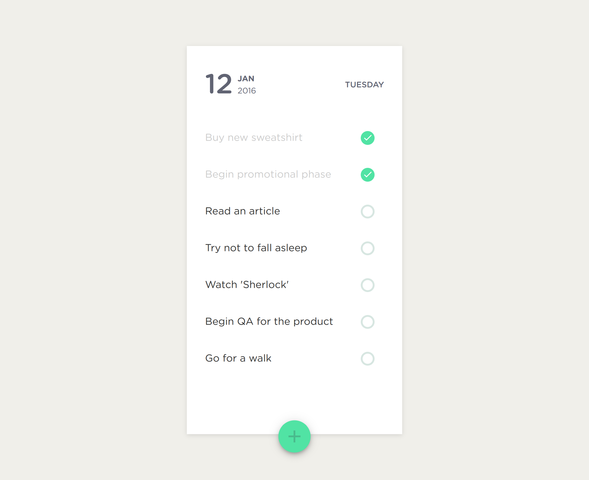

# ToDo List App

## Idea

[ToDo List by Goutham](https://dribbble.com/shots/2451888-ToDo-List)

<table width="100%">
  <tr>
    <td>Original</td>
    <td>Current project view: <a href="https://cemalgnlts.github.io/todo-list">cemalgnlts.github.io/todo-list</a></td>
  </tr>
  <tr>
    <td width="50%">
      
    </td>
    <td width="50%">
      
    </td>
  </tr>
</table>

## Colors

| Color Name        | Hex         |
| :---------------: | :---------: |
| Background        | **#fff**    |
| Foreground        | **#f0efea** |

## Font Family

* GothamRounded
